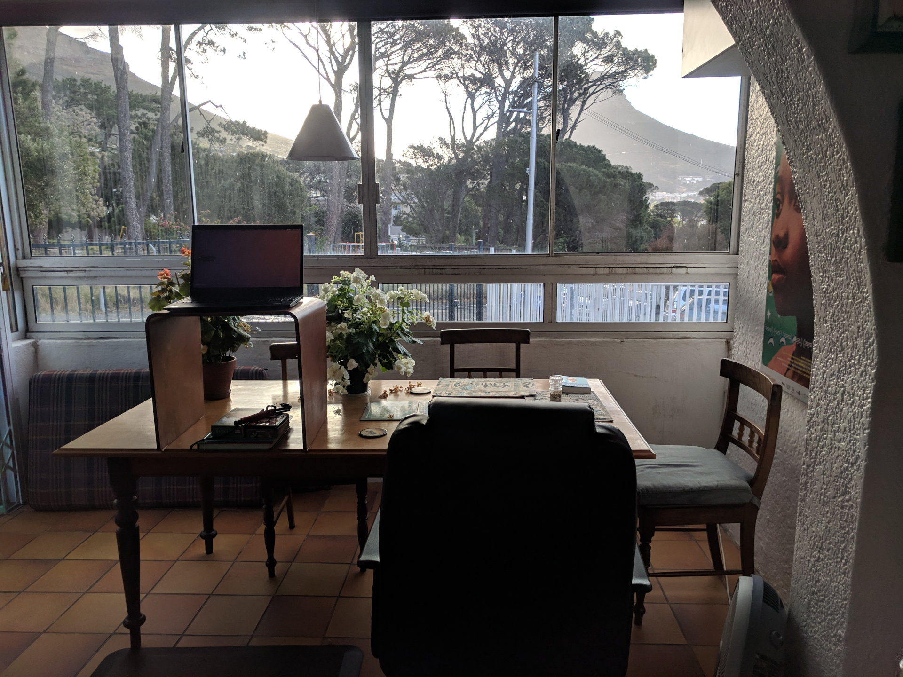
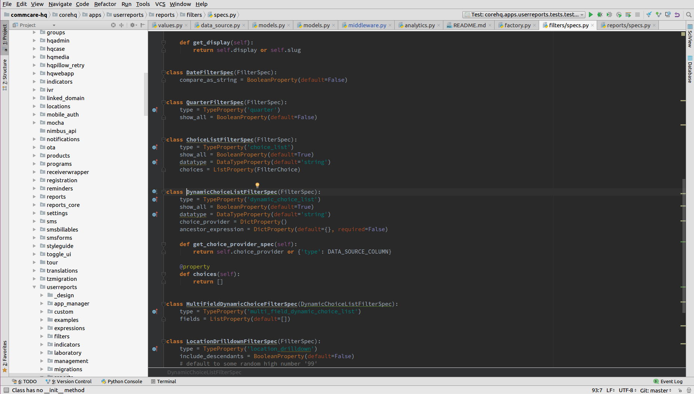

# Cory Zue

Hi I'm Cory Zue and I'm a full stack software developer, maker, and aspiring entrepreneur. I'm most known for documenting the development of [Place Card Me](https://www.placecard.me/), a side-project I've managed to monetize to about $1500 / month in revenue. In the last year, I've built and launched [many other projects](http://www.coryzue.com/projects/). I also work part time for [an awesome social enterprise called Dimagi](https://dimagi.com/) where I served as CTO from 2006-2017, and do a splash of freelance consulting.

## My Days

Because I work on a lot of different things I like to keep a flexible schedule, though try to do the majority of my productive work between 7:30am and 6pm on weekdays. Since my time is almost 100% self-scheduled, it's good to have some enforced consistency.

My typical routine on a work day is:

1. Wake up between 6:30 and 7 (I don't use an alarm so this time varies from day to day)
2. Putter on my phone in bed for 20 mins glancing at email, Twitter, etc. This gets my brain moving
3. Make breakfast---usually cereal or toast----and a great big cup of coffee.
4. Meditate for 10 minutes, either on the Headspace app or just simple unguided meditation on my own
5. Work for 3-4 hours
6. Go for a run outdoors
7. Eat lunch, usually leftovers or a sandwich
8. Work for another 4-5 hours
9. Cook, dinner, unwind, etc.

The one thing that varies the most in my schedule is exercise, which I try to time with the weather and my own energy. I use my run to get a boost when I start feeling low energy, which usually happens towards the end of the morning or in the middle of the afternoon.

I usually work between 7 and 9 hours a day and almost never do any work after I stop for the day. I like to keep my nights completely clear and my work and personal lives completely separate, though I often do a bit of work on weekends. On weekends if I'm working I'll try to prioritize fun, self-driven projects and rarely do work for others.

## My Space

Most days I'm working from home. I spend the majority of my time in my living room working directly on my laptop and alternating between an ad-hoc standing desk (which is just a little table on top of another table), a sitting desk, and the couch. I've had some back and wrist issues in the past and for me "the best position is the next position", so I like to move frequently. I also find that certain positions or changing positions helps kick my brain (for example I do most of my writing while standing).

My living room looks out over Lion's Head (a picturesque mountain in Cape Town) and I enjoy staring out the window as I pause to think. Also the sunsets are spectacular (and a good reminder to start thinking about ending my day).

## My Rig

My machine is remarkably boring. I use a big, clunky Thinkpad running the latest (but not bleeding edge) version of Ubuntu---currently 16.04---and I customize very little. I haven't even changed my wallpaper from the default.

My primary requirements for a machine are: 1) that the keyboard is big enough to fit my hands, 2) that it has enough RAM to run all my apps and projects, currently 32GB, and 3) a "pointing stick", a.k.a. a nipple mouse in the middle of the keyboard. Like this:

The pointing stick is a hard requirement for me and something I use religiously. I'm a huge "keyboard only" advocate and so I love having a mouse that doesn't require that my hands leave the keyboard. One of the few customizations I *will* do on every new machine is immediately disable the trackpad.

That's basically it! No external mouse. No monitor. No fancy keyboard. Just me and my laptop, and a crappy pair of $5 earbuds (I keep like 4 pairs of these in my backpack since they break a lot). I find this setup keeps me as mobile as possible and I've never felt anything was lacking.

## Software

I do all of my coding in PyCharm using a dark theme and emacs key bindings. PyCharm is an amazing piece of software and its peripheral support for HTML, JavaScript, etc. make it usable even for non-Python projects.

Beyond the IDE, the overwhelming majority of my work happens in a browser. I'm pretty much all-in on web apps and for the most part that means I use a lot of Google products.

The first four tabs in my browser are always Inbox, Toggl (time tracking), a Google Doc with my daily/weekly goals and todo lists, and Google Calendar. The time and goal tracking are part of my working habits and systems, which I wrote more about [on my blog](http://www.coryzue.com/writing/working-alone/). Other web apps I use regularly are Trello, WhatsApp, TweetDeck, Pocket, and Google Keep.

My favorite customization I've made to the browser is adding a Chrome extension I made called [Photos New Tab](http://www.photosnewtab.com/) that replaces my new tab page with a random picture from my Google Photos account. I love having little memories of my life sprinkled throughout my day as I work.

Out of the browser, I spend a lot of time in the Terminal but I don't bother customizing it too much as it's usually just running various dev commands that are already in my history. I have setup a fair number of git aliases and little bash scripts for common sets of tasks, but that's mostly it.

Beyond that it's mostly standard utility software. Things like Slack, Spotify, Gimp (image editing), Keepass (password manager), etc. All in all I try to keep things pretty lean and simple.

## Get in Touch

I think that about wraps it up! If you'd like to know more about me or get in touch you can read and find my email [on my blog](http://www.coryzue.com/), or [hit me up on Twitter](https://twitter.com/czue). Thanks for reading!
