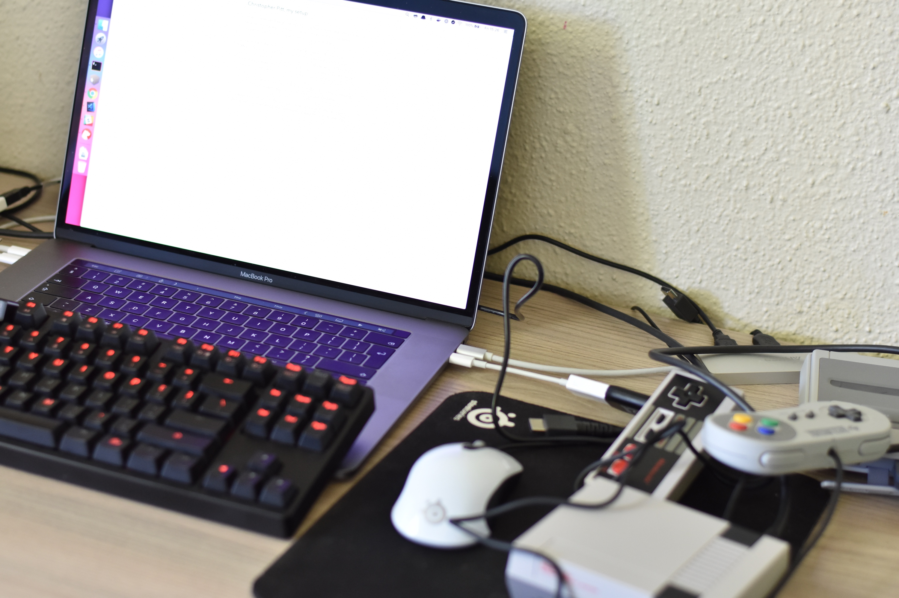
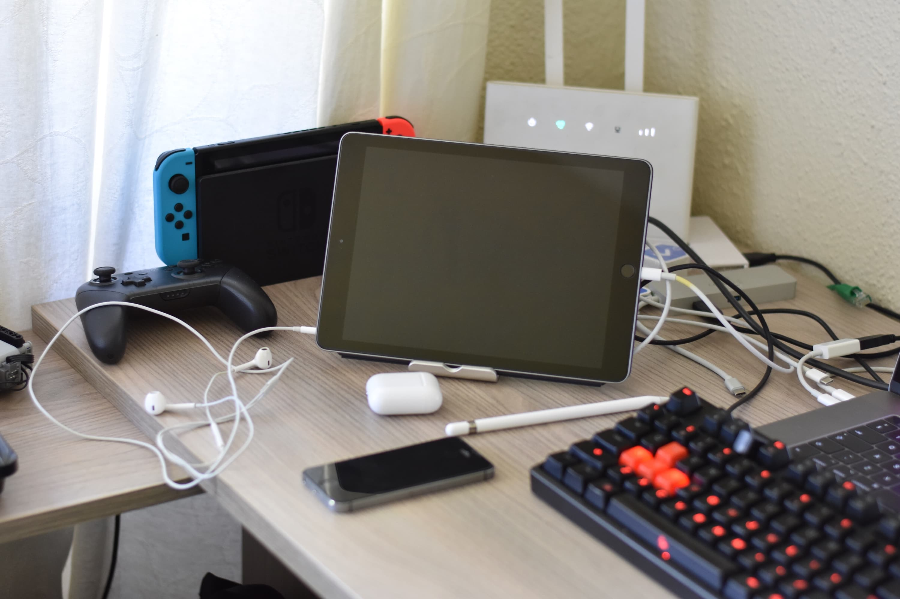
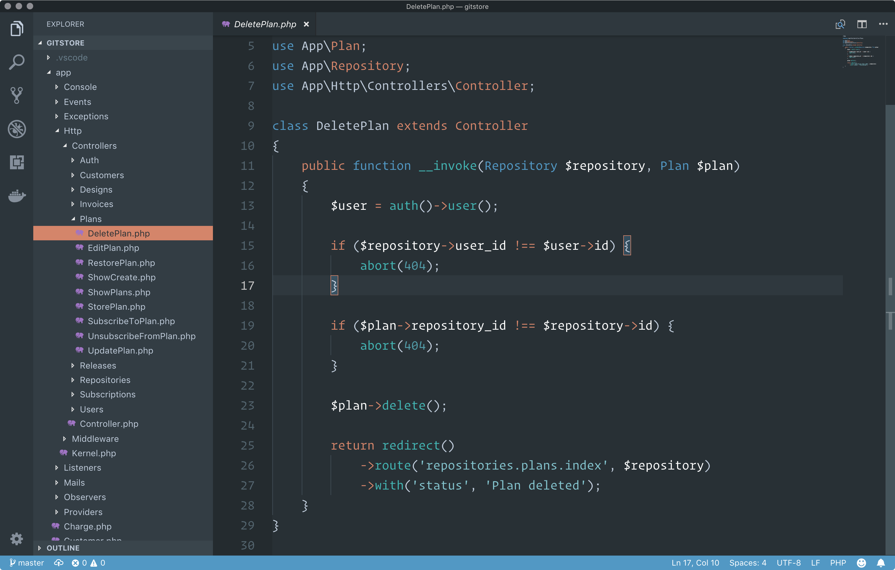
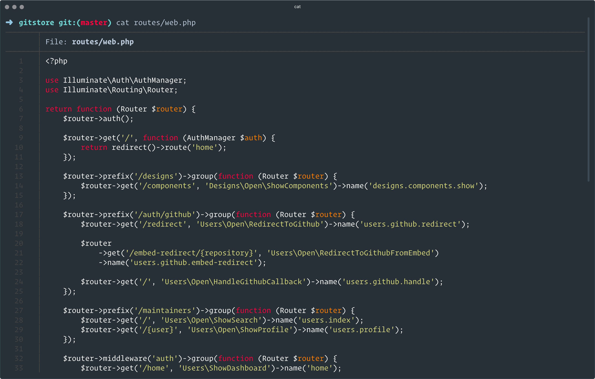

# Christopher Pitt, my setup

I’m an indefatigable experimenter. If you’ve heard of me, at all, it’s probably because of some way-out-there conference talk or tutorial. I’ve been programming in PHP and Javascript for roughly a decade.

I married, with 4 kids, so I do my best work between 04:00 and 08:00. Means I’m usually in bed around around the same time your grandad is. I set a couple alarms, for 05:00 and 05:30, but I often wake up before then. If the first alarm wakes me up, I have until the second alarm goes off to think. These 30 minutes, without a screen, are the clearest of the day.

I have a home office, so I mosey on over to that. We live in a tiny apartment, so it’s too noisy to make coffee until most of the people are awake.

I always see posts about other people’s desks, and marvel at how orderly things are. I can’t remember the last time mine wasn’t full of stuff. The whole office is full of stuff. I build a lot of LEGO and electronic things; so that’s usually what I’m tripping over in here. The kids love the LEGO side of things, but I can’t wait until they have the patience and interest to try the electronic side…

I work on a MacBook Pro (with Touch Bar). I’ve cycled through an assortment of mechanical keyboards, but my favourite is broken. Not sure if I can get it repaired, given how I put it together, so I might just buy another when I have some spare money for that.

I don’t use an external monitor. I don’t want to grow dependent on working with one, because that affects how I would present at meet-ups and conferences. Similarly, my code editor font size is abnormally large so that I am used to that for when I need others to follow my code. Larger code also means longer line-lengths, so this way I keep things presentable for slides and blog posts.

I’ve used [VS Code](https://code.visualstudio.com/) for about 6 months now. Before that, I used [Atom](https://atom.io/). I may move back to Atom now that [Tree Sitter](https://www.youtube.com/watch?v=a1rC79DHpmY) is part of it. That project looks amazing! I use [Hyperterm](https://hyper.is/), [Homebrew](https://brew.sh/), Git from the command-line, [Oh My ZSH](https://github.com/robbyrussell/oh-my-zsh), [Chrome](https://www.mozilla.org/en-US/firefox/new/), and [BearNotes](https://bear.app/). I’m typing this in BearNotes, actually.

I use [Operator Mono](https://www.typography.com/fonts/operator/styles/) and Blink ([Rainglow](https://rainglow.io/)) everywhere I can. I don’t use Dark Mode or Night Shift (on macOS). I do use Night Shift on iPad though.

How I work is a lot less interesting than what I work on, I feel. You can find some interesting stuff over at [preprocess.io](https://preprocess.io) and [assertchris.io](https://assertchris.io). I’m also building a thing called [Gitstore](https://twitter.com/gitstoreapp), which is a way to sell code that doesn’t completely suck. You can find to me [on Twitter](https://twitter.com/assertchris), if you want to chat about any of this stuff.
