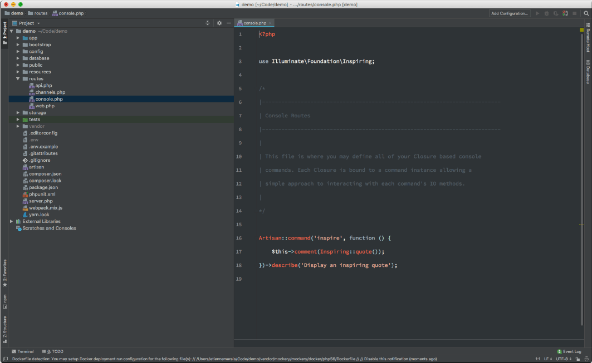
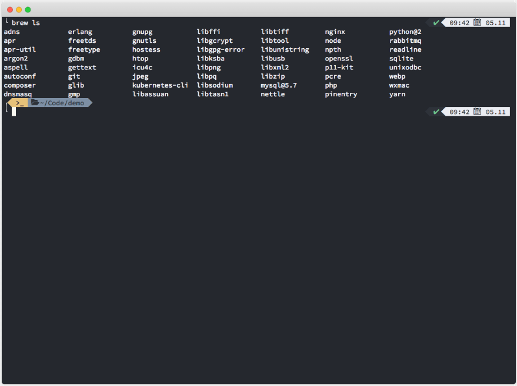
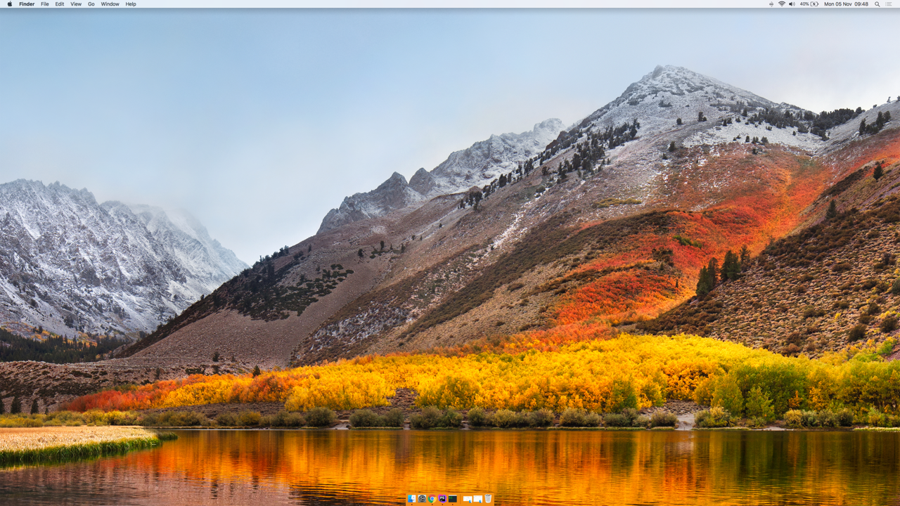

# Etienne Marais

I find a lot of inspiration from seeing how other developers and designers work. Borrowing from the way they setup their environment gives an interesting flair to the way I work but also being able to tweak that makes me feel great. I am a Full-Stack web developer and this is what I use to build applications using Laravel/VueJS and Docker.

## Editor

I use [PHPStorm](https://www.jetbrains.com/phpstorm) as my main editor and I use [Visual Studio Code](https://code.visualstudio.com/) as my secondary editor. For PHPStorm I use a tweaked version of the [Zeus theme](http://www.phpstorm-themes.com/theme/zeus) with [Source code pro for powerline](https://github.com/powerline/fonts/tree/master/SourceCodePro) as the font and lots of line spacing:

    font-size: 15
    line-spacing: 1.9

I use [Nightowl](https://github.com/sdras/night-owl-vscode-theme) for my VSCode theme with the same font settings.

## Extensions

### PHPStorm

PHPStorm comes bundled with some fantastic plugins. Here is the list of custom ones I added for extended functionality:

* [.env files support](https://plugins.jetbrains.com/plugin/9525--env-files-support)
* [.ignore](http://ignore.hsz.mobi/)
* [ansi highlighter](https://plugins.jetbrains.com/plugin/9707-ansi-highlighter)
* [Bash Support](https://plugins.jetbrains.com/plugin/4230-bashsupport)
* [EditorConfig](https://editorconfig.org/)
* [Handlebars/Mustache](https://github.com/dmarcotte/idea-handlebars)
* [Idealog](https://github.com/JetBrains/ideolog/wiki/Custom-Log-Formats)

### VSCode

[Vue VSCode Extension pack](https://github.com/sdras/vue-vscode-extensionpack)

### Terminal

I use [iTerm2](https://iterm2.com/) as my terminal. I use [oh-my-zsh](https://github.com/robbyrussell/oh-my-zsh)’s default command prompt combined with a custom version of the "[Powerlevel9k](https://github.com/bhilburn/powerlevel9k)" theme. I use [Homebrew](https://brew.sh/) to manage all my commandline applications. I use Yarn as my global JavaScript package manager and Composer as my global PHP package manager.

### Environment

I use [Laravel Valet](https://github.com/laravel/valet) to configure my environment with the following versions:

* Nginx (nginx/1.15.2)
* PHP (7.2)
* MySQL (5.7)
* RabbitMQ (3.7.8)
* Node (10.11)
* NPM (6.4.1)
* [Mailcatcher](https://mailcatcher.me/)

### Hardware

I run:

* 2 x [Dell UltraSharp U2515H 25-Inch Screen LED-Lit Monitors](https://www.amazon.com/Dell-UltraSharp-U2515H-25-Inch-LED-Lit/dp/B00SPWPF1O/ref=cm_cr_arp_d_product_top?ie=UTF8)
* Macbook Pro (15 inch, 2017), 2,8 GHz Intel Core i7, 16GB RAM, 256GB Storage
* Apple Magic Mouse
* Apple Magic Keyboard
* [Sennheiser HD 4.40 Bluetooth Headphones](https://www.takealot.com/sennheiser-hd-4-40-bluetooth-headphones/PLID46575631)
* Various adapters
* [Wild Ficus Bonsai](https://www.youtube.com/watch?v=o_biZILzHU4) (Small one)

### Communication

I primarily use Slack in my browser.

### Music

I am a big fan of heavy progressive house/trance music when I code and I find mixes primarily on [Mixcloud.com](http://mixcloud.com/).

* [Above and Beyond](https://www.mixcloud.com/aboveandbeyond/)
* [Future sound of Egypt](https://www.mixcloud.com/alyfila-futuresoundofegypt/)
* [Anjunadeep](https://www.mixcloud.com/anjunadeep/)
* [Sub88](https://www.mixcloud.com/sub88/)
* [International Departures](https://www.mixcloud.com/internationaldepartures/)

### Misc

* Trello (Personal and Work tasks)
* Google Inbox (Email and task manager)
* SequelPro (Database Admin)
* GSuite (Email, Storage, Calenders, Docs, Sheets, Presentations)
* LastPass (Password manager)
* [Bursts.io](http://bursts.io/) (Sending weekly product and team updates)
* [Momentum dash](https://momentumdash.com/) (Clean browser starting page)
* [Shotsnap](https://shotsnapp.com/) (Screenshot maker)
