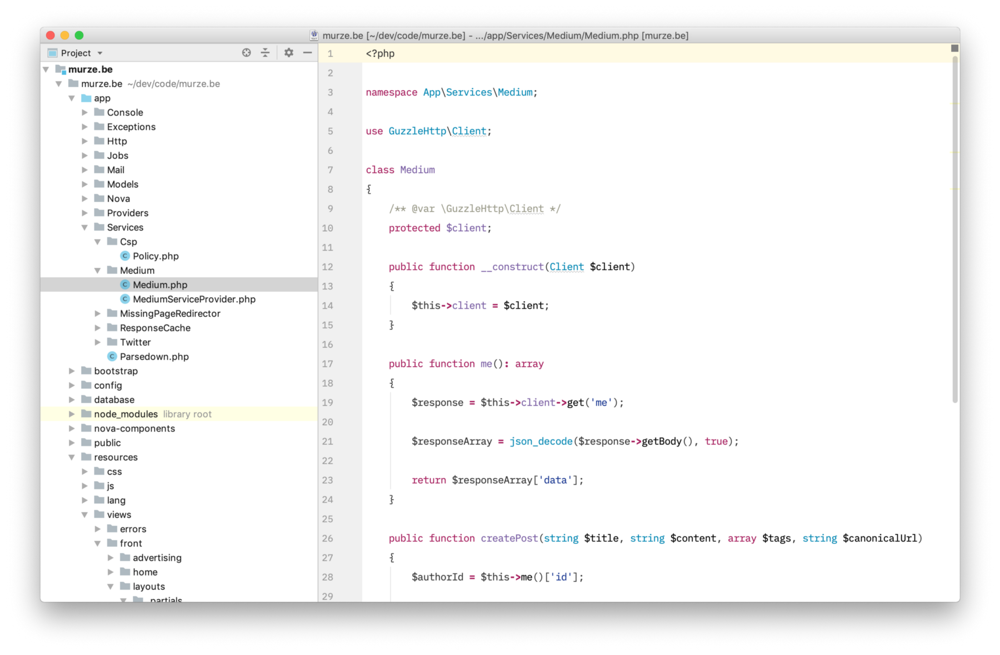
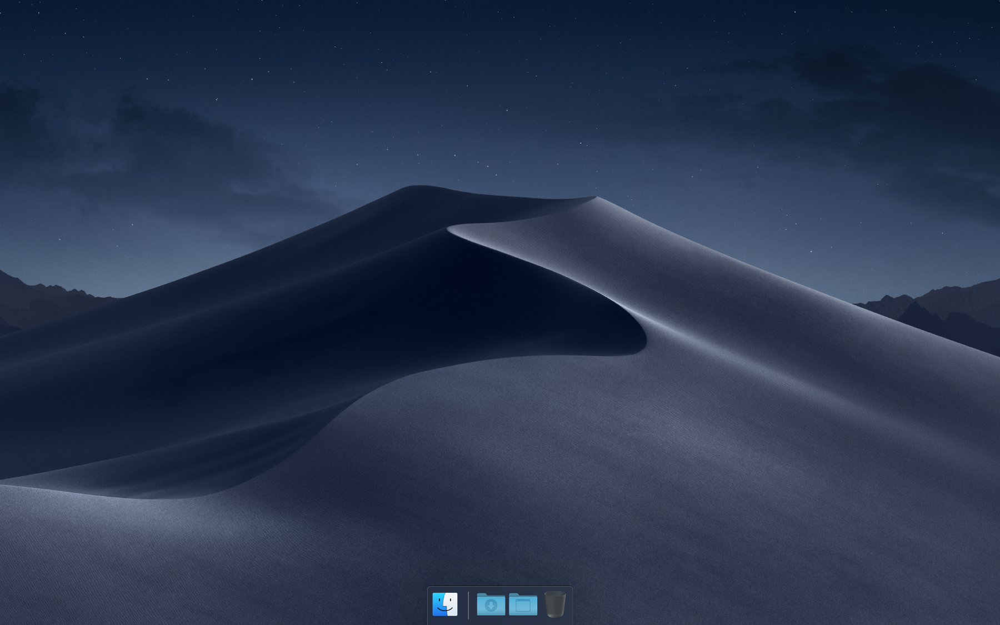
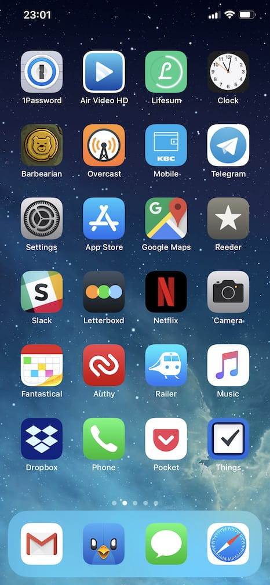

# Freek Van der Herten My current setup (2018 edition)

After tweeting out a screenshot, it often get questions around [which editor](https://twitter.com/bashgeek/status/1053559280035491840), font or color scheme I’m using. Instead of replying to those questions individually I’ve decided to just write down the settings and apps that I’m using.

## IDE

I mainly program PHP. Mostly I develop in [PhpStorm](https://www.jetbrains.com/phpstorm). Here’s a screenshot of it:

You can find the color scheme that I’m using [in this repo](https://github.com/freekmurze/phpstorm-color-schemes). The font used is IBM Plex Mono: an awesome font that you can download for free in the [official IBM repo](https://github.com/IBM/plex/tree/master/IBM-Plex-Mono/fonts/complete/ttf).

Like seen in the screenshot I’ve hidden a lot of things of the UI of PhpStorm. I like to keep it minimal. I use the [settings sync feature](https://www.jetbrains.com/help/phpstorm/sharing-your-ide-settings.html#settings-repository) of PhpStorm to backup my settings to [this repo on GitHub](https://github.com/freekmurze/phpstorm-settings).

I like working using a light based theme. In some circles this is [maybe a bit controversial](https://twitter.com/Loruzzz/status/1053561991934214144). Watch [this excellent video](https://youtu.be/rDMI1dpNfdw?t=353) by my colleague Brent to learn what the benefits of using a light based theme are.

## Terminal

Here’s a screenshot from my terminal.

All my terminal settings are saved in [my dotfiles repository](https://github.com/freekmurze/dotfiles). If you want the same environment you follow the installation instructions of the repo.

My terminal of choice is [iTerm2](https://www.iterm2.com/). I’m using the [Z shell](https://en.wikipedia.org/wiki/Z_shell) and [Oh My Zsh](https://ohmyz.sh/).

The color scheme used is a [slightly modified version of Solarized Dark](https://github.com/freekmurze/dotfiles/blob/master/misc/Solarized%20Dark%20Corrected.itermcolors). The font used is [a patched version of Menlo](https://github.com/freekmurze/dotfiles/blob/master/misc/Menlo-Powerline.otf). I’m using several hand crafted [aliases](https://github.com/freekmurze/dotfiles/blob/master/shell/.aliases) and [functions](https://github.com/freekmurze/dotfiles/blob/master/shell/.functions).

## MacOS

I’m a day one upgrader of MacOS, so I’m always using the latest version. I also sometimes dare to use beta versions of MacOS when people are saying it’s stable enough.

By default I hide the menu bar and dock. I like to keep my desktop ultra clean, even hard disks aren’t allowed to be displayed there. On my dock there aren’t any sticky programs. Only apps that are running are on there. I only have a stacks to Downloads and Desktop permanently on there. Here’s a screenshot where I’ve deliberately moved my pointer down so the dock is shown.

I’ve also hidden the indicator for running apps (that dot underneath each app), because if it’s on my dock it’s running.

In [my dotfiles](https://github.com/freekmurze/dotfiles) repo you’ll find [my custom MacOS settings](https://github.com/freekmurze/dotfiles/blob/master/macos/set-defaults.sh).

These are some of the apps I’m using:

* To run projects locally I use [Laravel Valet](https://laravel.com/docs/5.7/valet).
* I couldn’t live without [Alfred](https://www.alfredapp.com/). I’m using several workflows. First up is [syn and assoc](https://github.com/sebastiandedeyne/naming-things-alfred-workflow) by [Sebastian De Deyne](https://twitter.com/sebdedeyne), to help with naming things. [phpstorm](https://github.com/bchatard/jetbrains-alfred-workflow) by [bchatard](https://github.com/bchatard) to easily open recent PhpStorm projects. Last by not least I use the [Laravel docs workflow](https://github.com/tillkruss/alfred-laravel-docs) by [Till Krüss](https://twitter.com/tillkruss) to easily search the Laravel docs.
* To connect to S3, ftp (😱) and sftp servers I use [Transmit](https://panic.com/transmit/).
* Sometimes I need to run an arbitrary piece of code. [CodeRunner](https://coderunnerapp.com/) is an excellent app to do just that.
* [Paw](https://paw.cloud/) is an amazing app to perform API calls.
* [Moom](https://manytricks.com/moom/) is used to quickly resize windows quarter, half and full screen.
* Databases are managed with [SequelPro](https://sequelpro.com/).
* [MySQLWorkbench](https://www.mysql.com/products/workbench/) is used to draw ERDs. Even though the interface is a bit sucky, it does the job.
* My favourite cloud storage solution is [Dropbox](https://dropbox.com/). All my personal documents are on there and at [Spatie](https://spatie.be/) we use it extensively too.
* If you’re not using a password manager, you’re doing it wrong. I use [1Password](https://1password.com/). Personal passwords are sync in a vault stored on Dropbox. For Spatie we have a team account.
* All settings of my apps are backupped to Dropbox through [Mackup](https://github.com/lra/mackup). This is a fantastic piece of software that moves all your preferences to Dropbox and symlinks them.
* I don’t use Time Machine, my backups are handled with [Backblaze](https://www.backblaze.com/).
* Tweets are tweeted with [Tweetbot](https://tapbots.com/tweetbot/mac/).
* I read a lot of blogs through RSS feeds in [Reeder](http://reederapp.com/mac/).
* Mails are read and written in [Mailplane](https://mailplaneapp.com/), a wrapper around the Gmail web interface.
* My browser of choice is [Google Chrome](https://www.google.com/chrome/). To block ads on certain sites I use [the Ghostery plugin](https://www.ghostery.com/).
* I like to write long blogposts in [iA Writer](https://ia.net/writer).
* Calendars are managed in [Fantastical 2](https://flexibits.com/fantastical).
* I don’t often publish videos, but when I do, I create them using [ScreenFlow](https://www.telestream.net/screenflow/overview.htm).
* Even though I’m not a designer I sometimes have to edit images. For this I use [Pixelmator](https://www.pixelmator.com/pro/).
* To quickly change the volume in iTunes I use [SizzlingKeys](http://www.yellowmug.com/sizzlingkeys/).
* [GrandPerspective](http://grandperspectiv.sourceforge.net/) is a hidden gem that helps you determine how your disk space is being use used.
* I have a band. We do all our recording ourselves. For this I use [Reaper](https://www.reaper.fm/).

## iOS

Here’s a screenshot of my current homescreen.

I don’t use folders and try to keep the number of installed apps to a minimum. Most of my time is spent in Safari, Pocket, Reeder and Tweetbot. Notifications and notification badges are turned off for all apps except Messages.

Here’s a rundown of some of the apps currently on the homescreen:

1Password: my favourite password manager
Air Video HD: I find it much more reliable to sync videos to this one the stock Videos app. No iTunes needed.
Lifesum: I’m currently trying to lose some weight. I use this app to track my weight. I’m just using the free version.
Clock: tick, tock, …
Barbearian: I tend to have one game at a time on my phone and currently that’s Barbearian, a fun hack and slasher.
Overcast: an excellent podcast client
Mobile: horribly named, this the mobile banking app of my bank
Reeder: an RSS client
Slack: for communicating with my team and some other communities
Letterboxd: a pretty imdb. I use it to log every movie I watch
Railer: to easily look up the train schedules in Belgium
Pocket: my favourite read later service
Things: contains my to do’s

## Hardware

I’m using a Macbook Pro 13" with 16GB of RAM and 1TB hard disk. I opted for that big hard disk to be able to store my entire music and photos collection on the drive. Now that iTunes Music and Photos services are here, I probably would pick a smaller HD if I were to buy a new machine today.

Both at home and at the office I have these:

* a wireless Apple Magic Keyboard with numeric keys
* an Apple Magic Trackpad 2
* an [LG 27UD59P-B](https://www.lg.com/ca_en/desktop-monitors/lg-27UD59P-B) external monitor

At home I play music on a HomePod stereo pair. To stay in “the zone” when commuting and at the office I put on my [QuietComfort 35 wireless headphones](https://www.bose.com/en_us/products/headphones/over_ear_headphones/quietcomfort-35-wireless-ii.html).

My current phone is an iPhone Xs Max with 64 GB of storage.

## In closing

I hope you enjoyed this little overview of the stuff I’m using. I plan on writing a post like this every year.

If you have any questions on any of these apps and services, feel free to ping me on [twitter](https://twitter.com/freekmurze).
