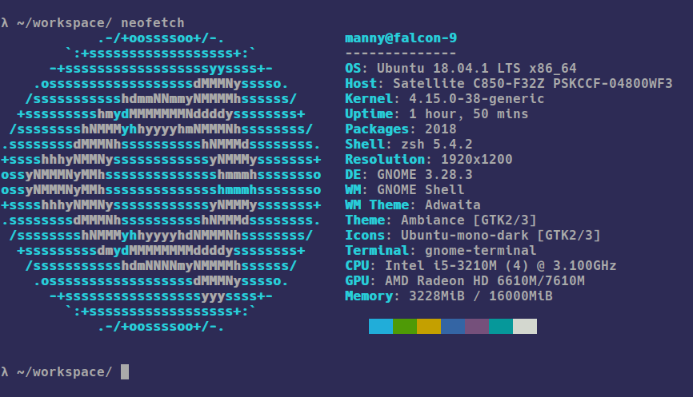
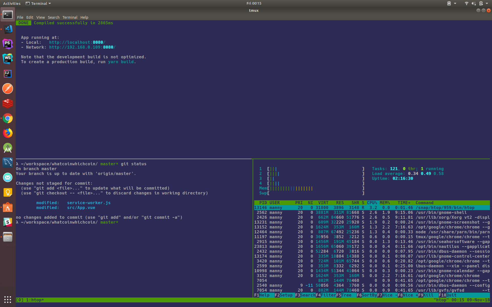
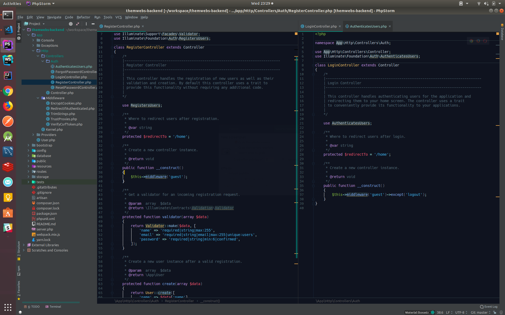
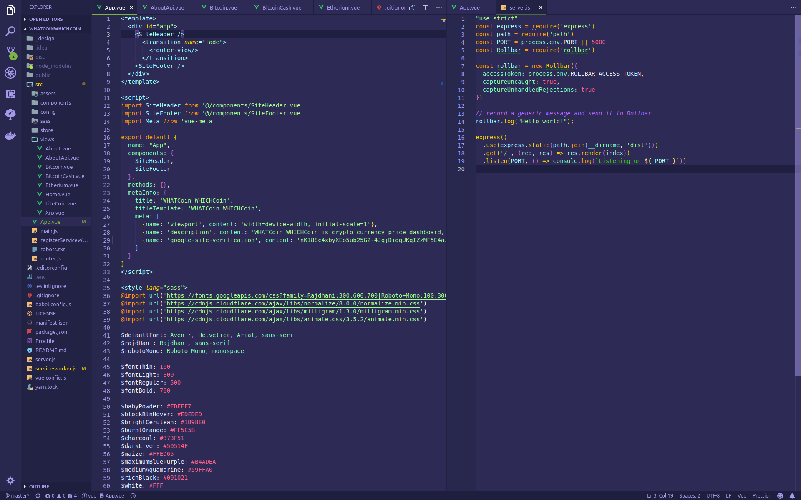

# Mannuel Ferreira, my setup

What's up world! I'm a Software Engineer, specialist on the front end. I enjoy writing JavaScript, PHP, HTML5, CSS. I recently picked up Python enjoying that too. 

Thought I'd take some time out to share my setup. I'm a Linux fan, I dig upgrading it, hacking on it, the challenge of fixing it... which to be honest is not that often these days on 18.04.


# Hardware

I hack on a red Toshiba Satellite c850 =>


[Neofetch](https://github.com/dylanaraps/neofetch) cool cli tool spits out your system details as above.

### Upgrades
You gotta buy more RAM so ran out and bought 16BG on day one of purchasing this machine. I recently upgraded the HDD to a HP 240 GB SSD, life changing move so much speed. I use a Samsung 24 inch Screen does the job.

# Software

My development environment...

* [Android Studio](https://developer.android.com/studio/) I enjoy testing my sites in the mobile VMs' it's a lot of fun.
* [Docker](https://www.docker.com/)
* [Firefox Developer Edition](https://www.mozilla.org/en-US/firefox/developer/), the tools for testing CSS grid and Flex box are much better here than in Google Chrome at time of writing.
* [Firefox](https://www.mozilla.org/en-US/firefox/new/)
* [Google Chrome](https://www.google.com/chrome)
* [kubernetes](https://kubernetes.io/)
* [Minikube](https://kubernetes.io/docs/tasks/tools/install-minikube/) on [KVM](https://www.linux-kvm.org/page/Main_Page)
* [Mysql Workbench](https://www.mysql.com/products/workbench/)
* [nvm](https://github.com/creationix/nvm) to switch node versions
* [Postman](https://www.getpostman.com/)
* [pyenv](https://github.com/pyenv/pyenv) to switch python versions


Do I need all of this malarky... I love software, so yes.

## Editors

I use [PHPStorm](https://www.jetbrains.com/phpstorm) for Laravel projects,[Visual Studio Code](https://code.visualstudio.com/) for Node.js and Python projects. I have a few key plugins and themes installed. 

Dark colourfull themes 98% of time, if the sun is shining into the flat just at the right angle I might have to turn on a white theme... or go outside and play.

### Terminal



I choose VIM, tmux and Oh MyZsh  with four plugins enabled.

* lambda theme
* colored-man-pages
* git
* zsh-autosuggestions

### PHPStorm


I set Darcular on with Material Theme and Icons. I edited the theme slightly I used Hack font and added some purple to the mix.

### Material Theme UI
[https://plugins.jetbrains.com/plugin/8006-material-theme-ui](https://plugins.jetbrains.com/plugin/8006-material-theme-ui)

### Hack Font
[https://sourcefoundry.org/hack/](https://sourcefoundry.org/hack/)

## VSCODE 


### Shades of Purple theme

1st Choice of theme, again using Hack font.

```bash
ext install ahmadawais.shades-of-purple
```

### IntelliJ IDEA Keybindings

This makes jumping between PHPStorm and VSCODE a breeze.

```bash
ext install k--kato.intellij-idea-keybindings
```

###  Material Icon Theme

```bash
ext install PKief.material-icon-theme
```

### Bracket Pair Colorizer

Callback hell... solution colourize the matching brackets.

```bash
ext install CoenraadS.bracket-pair-colorizer
```

## Communication

* [Mailspring](https://getmailspring.com/)
* Google keep for notes and lists
* Google docs
* Slack
* Skype

