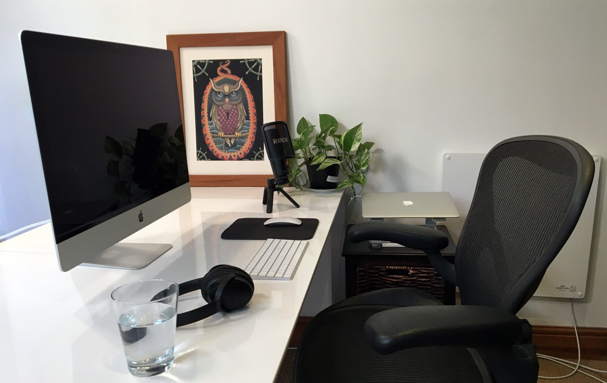
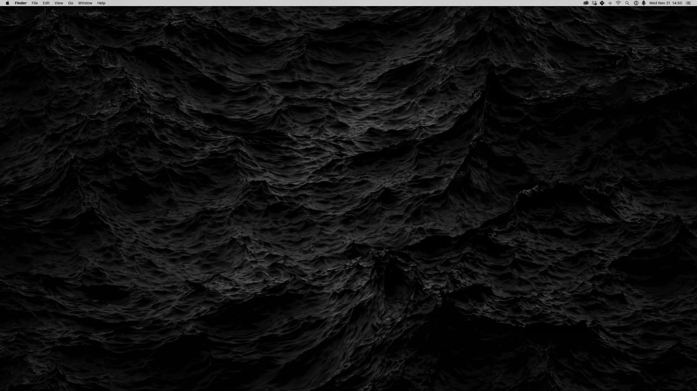
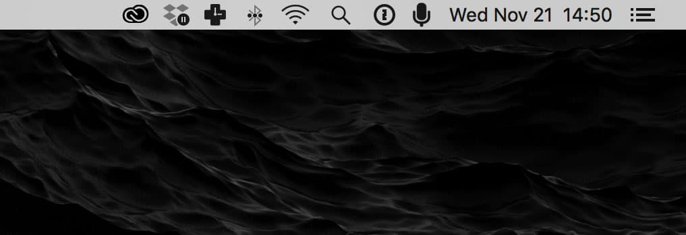
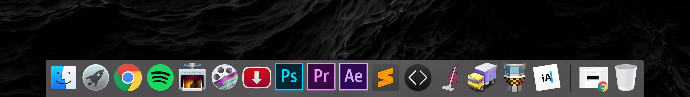
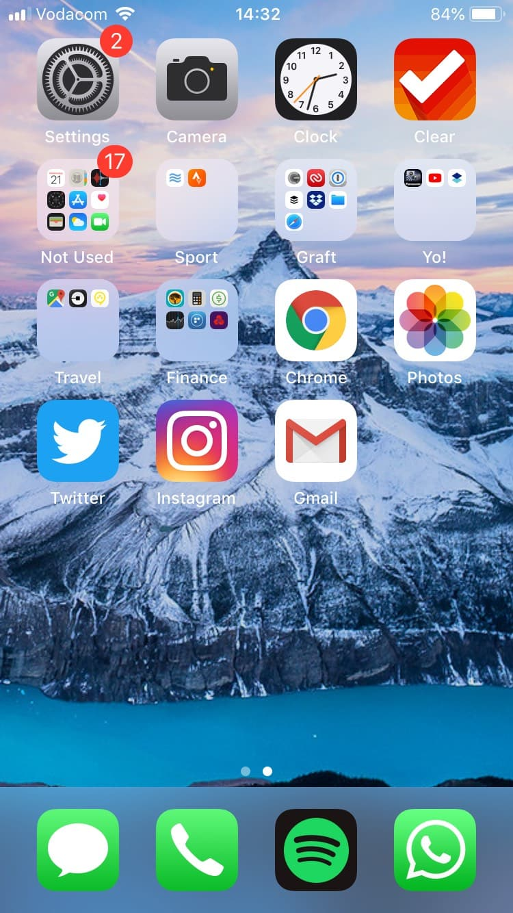

# Rob Hope

Yo! I'm Rob, a maker of online things, based in Cape Town, South Africa. I quit freelance a little while ago to work full time on my websites [One Page Love](https://onepagelove.com/), [Email Love](https://emaillove.com/), [Tide.is](https://tide.is/) and [AudioNot.es](https://audionot.es/). My job is essentially trying to make those puppies the best they can be.

So I've been refining my work situation for years and finally down to a 6-7 step commute to my work place. This is my office setup where I work around ~10hrs on weekdays and ~6hrs on Saturdays:

## Work Gear

I'm rolling a late 2015 Retina 5K 27" iMac with 16GB Ram and 1TB Fusion Storage. As much as love being mobile with a laptop, the 27" Retina screen is sooo good for video editing and designing. It really ups my output. This is my desktop view, no icons, just this epic black ripple wallpaper by [Jean-Marc Denis](http://jmd.im/black). I've had this background set for about 2 years:

When I'm traveling I'm using an early 2014 13" MacBook Air with 4GB Ram and 120GB SSD Storage. This guy is so underrated and robust. If it had a Retina screen I wouldn't need much else on the road. When I get cabin fever I throw this dude in my backpack and do admin/planning in coffee shops.

Other work items include:

* Apple magic mouse
* Apple keyboard
* Griffin Elevator laptop stand for the Air
* Bose QC-25 headphones for beats
* Aeron office chair by Herman Miller (the best investment I've made working online, worth every cent)
* Lapel Audio Rec - [Zoom H1](https://amzn.to/2vlFSkH)
* Lapel Mic - [Azden](https://amzn.to/2vil0es)
* Studio Camera - [Lumix GH4](https://amzn.to/2HDz1pq)
* Rode NT-USB USB condenser microphone for video voice overs
* Studio Lens - [12-35mm, F2.8](https://amzn.to/2J3CA7Z)
* Studio Lights - [Godox](https://amzn.to/2qzBMjs)
* [GoPro Hero6 Black](https://amzn.to/2HFcwR1) for video on road

I'd like to think I'm a minimalist but I have tons of surf gear and more recently camera gear as I've been making YouTube videos ([youtube.com/robhope](https://www.youtube.com/robhope)).

## Work Software & Subscriptions

I don't specifically do one main thing so my day-to-day involves quite a few tools to get it all done. I've included subscription costs in case you are interested:

* Dropbox and Dropbox Paper (backups, drafting content) $100/year
* Adobe Suite (Photoshop, Premiere, After Effects, Audition) $49/month
* Epidemic Sound (Beats for videos) $15/month
* Spotify (Music) $5/month
* [Constant Contact](https://emaillove.com/go/constant-contact) (Newsletter mgnt for Email Love) $20/month
* [Email Octopus](http://onepagelove.com/go/emailoctopus) (Newsletter mgnt for One Page Love) $15/month
* [AudioNot.es](https://audionot.es/) (Menubar app to send audio messages in emails)
* 1Password (Password Management)
* iA Writer (Ideas, notes)
* ScreenFlow (Rec & edit voice overs + screen interactions)
* Sublime Text (Coding)
* Codekit (Sass)
* Transmit (SFTP)
* Tower (Git Management)
* Site Sucker (Downloading full websites to inspect)
* Ummy Video Downloader (YouTube HD vid downloads)
* TripMode (Prevents app upgrades while traveling)
* ImageOptim (Speedy image compression)
* RescueTime (Productivity tracking)
* Google Chrome (Default browser where I have a few extensions I need for work)

Here is my menubar area:

Here is my dock area (this is hidden on default):

## Hosting, Domains and Email

Maybe of interest if you have a few websites, this is my setup running my network of projects:

* [Flywheel](https://onepagelove.com/go/flywheel) (WordPress hosting for One Page Love, Email Love and my personal website) $100/month
* Digital Ocean (Hosting for Tide.is) $5/month
* Amazon AWS (Hosting for AudioNot.es) $10/month
* Google Apps (Email for 4 domains) $20/month
* AppStore Account (for AudioNot.es) $99/year
* Hover.com Account (for all my domains)

## Mobile Setup

I'm rolling an iPhone 6s and no plan to upgrade any time soon. I remember having a 5s and WISH I had the 6 when I saw it. I keep reminding myself of that moment. It does absolutely everything I need.

My wallpaper is [this image](https://www.eoft.eu/blog/2016/01/wildlife-photographer-chris-burkard/) by Chris Burkard. I've had it set for maybe 4 years now:

My work apps on mobile are:

* Clear (to-do-list and notes)
* Gmail (email) R.I.P Inbox :(
* Dropbox Paper (Notes)
* 1Password (Password Management)
* Twitter and Insta for socials (I deleted Facebook from phone)
* Panasonic App (controls camera to help focus lens from desk)

Other notable mobile apps:

* Funds (Subscription tracking)
* Strava (Run/Hike tracking)
* Spotify (Beats)
* Google Chrome (Browsing)

## Work Process

No day is the same really. When I have a video to edit, everything stops and email/admin piles up. I have full focus during editing and work/life continues once I upload. It's an intense process!

Normal days are 06h30 start when my girlfriend goes to work. I listen to 90s punk rock or metal real loud while making coffee. Then I smash some emails and maybe review a One Pager for the One Page Love website - to get the rhythm for the day.

I'll make breakfast around 9am, followed by coffee #02. Then I'll work on whatever is on the to-do-list for the week.

Midday-ish I like to get out and either surf/run/walk to shop. I return, chow lunch, make coffee #03, work another 2 hours and then general start crashing around 15h30. I then power nap for 18 minutes and wake to a smoothy followed by an Espresso (Coffee #04). This combo gives me such a second wind to crush work until my girlfriend comes home around 7pm.

We then make food and are probably sleeping by 10pm. I used to work late but don't really want to anymore.

Nothing too exciting but this setup allows me to output a healthy 10hrs of work a day while bagging 8hrs sleep :)
