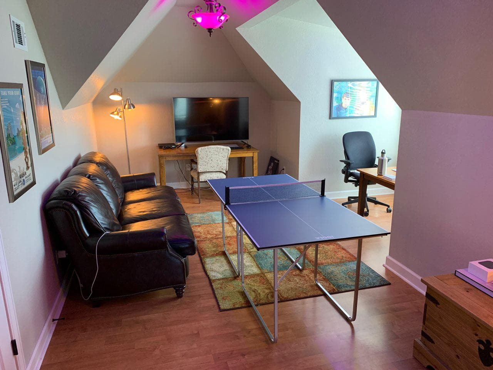
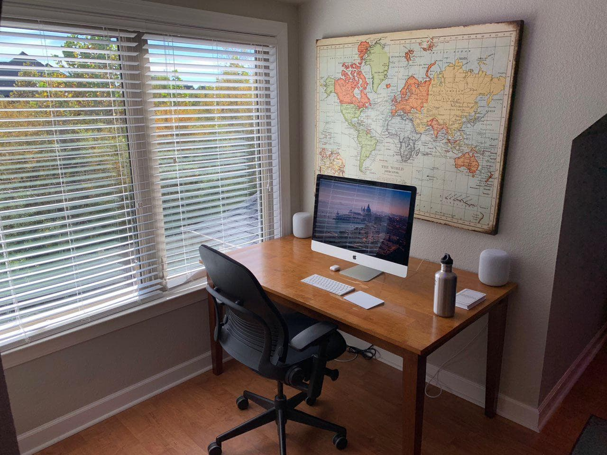
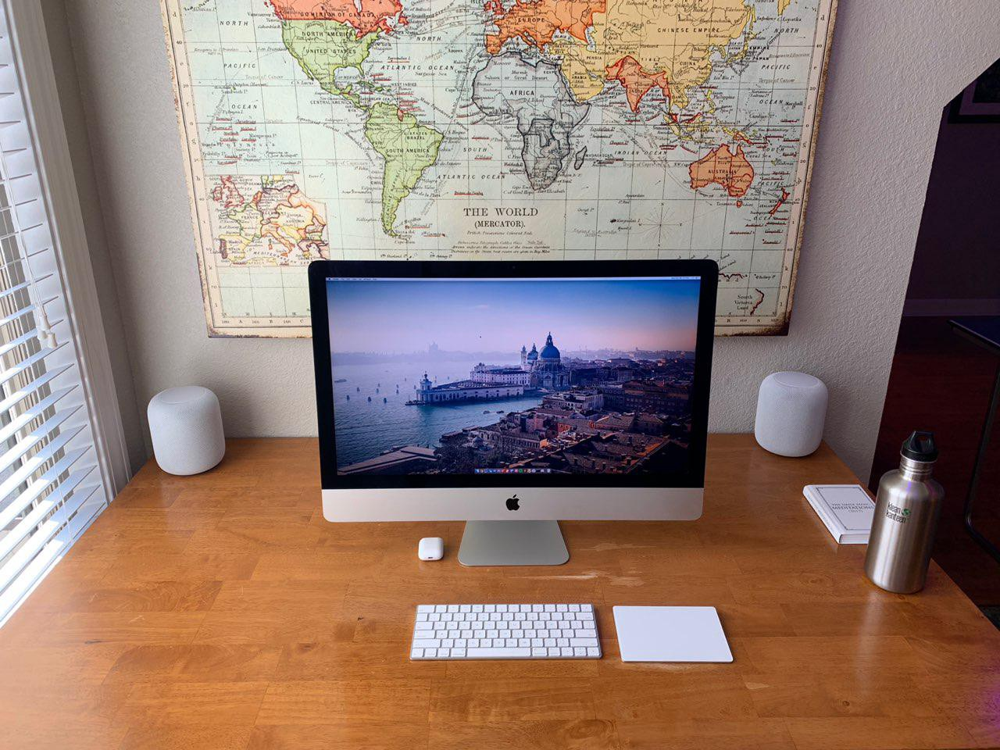
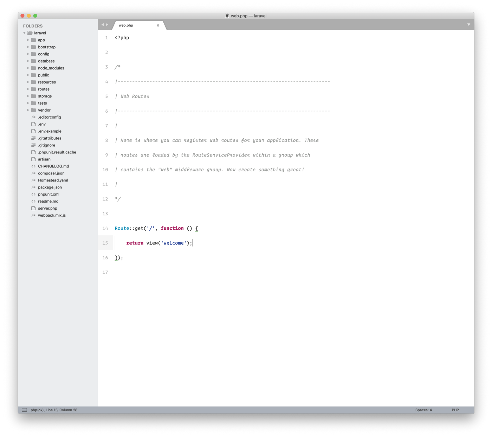
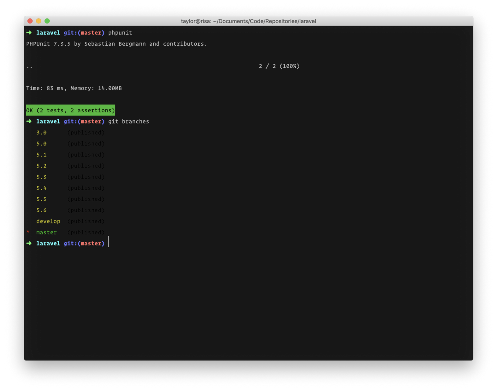
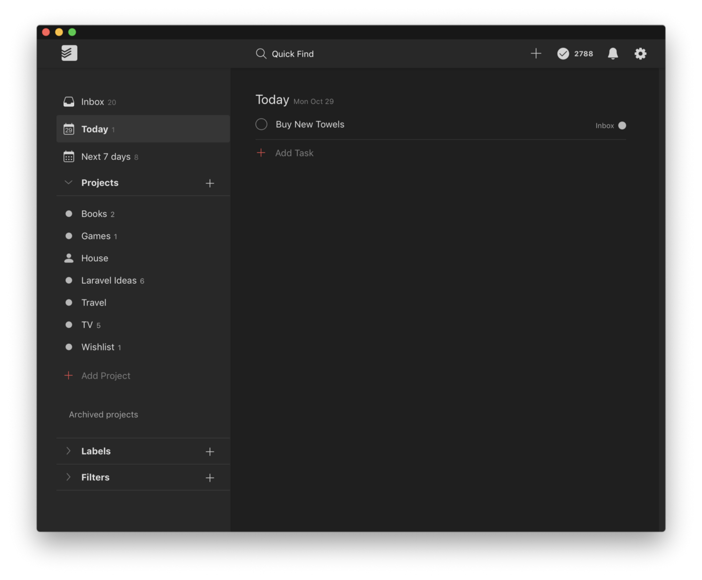

# Taylor Otwell How I Work (October 2018 Edition)

I’ve seen a [few](https://christoph-rumpel.com/2018/10/my-current-setup-in-2018) [people](https://medium.com/@freekmurze/my-current-setup-2018-edition-700687fbc838) share their work setups / processes lately, so I thought I would do the same!

## Office

Here is a photo of what my office looks like today. I need a tidy space to be in the right mindset to get work done 😅 … features Phillips Hue lighting, 4K TV, Mini Ping Pong Table, Stereo Pair HomePods, 5k iMac…

## Machines
5k iMac (4Ghz i7), 16GB RAM, 512GB Flash Storage.

I really love my 5k iMac. The display alone is worth $1,000, and the computer itself is still fast enough to easily handle everything I need to do.

When traveling or working outside of the house, I use a 2017 Retina MacBook Pro with TouchBar. I honestly like this machine quite a bit even though it’s gotten some negative reviews. I’ve gotten more used to the keyboard with time and the TouchBar doesn’t bother me. The screen is amazing.

If I need to use Windows, I have a Surface Book 2.

I use an iPhone XS Max as my primary phone.

## Editor

I use SublimeText 3 as my primary editor. I pair it with the Inspired GitHub color scheme, Operator Mono font, SublimeLinter, and a handful of keyboard short-cuts to run PHPUnit tests ([https://github.com/adamwathan/sublime-phpunit](https://github.com/adamwathan/sublime-phpunit)). I also make heavy use of Sublime’s “project” features and the Cmd+Shift+P short-cut to quick-switch between projects.

## Terminal

I use iTerm2 as my terminal. I use [oh-my-zsh](https://github.com/robbyrussell/oh-my-zsh)’s default command prompt combined with the “[Arthur](https://github.com/mbadolato/iTerm2-Color-Schemes/blob/master/schemes/Arthur.itermcolors)” color scheme:

## Todo

I use Todoist a lot. All day, every day. I primarily sit on the “Today” view and delegate tasks from there. I use the “smart date” parsing when scheduling tasks to quickly assign tasks a given date / time:

## Environment

I use [Laravel Valet](https://github.com/laravel/valet) to configure my Nginx / PHP environment. The speed and ease-of-use is hard to beat. If I need to run a project within Docker (typically when using Windows), I like to use [Vessel](https://vessel.shippingdocker.com/).

## Communication

I primarily use Telegram and Discord for communication. I’ve managed to get my entire family on Telegram 😅 and most of my Laravel communication these days takes place on the official [Laravel Discord server](https://laravel.com/discord).

## Music

For headphones, I primarily use my AirPods but I love the Bose QC35 when traveling or when I need to drown out some noise.

I use Spotify for music streaming, and primarily listen to deep / prog house electronic and rap. If you want to get a feel for what I might be listening to on any given workday, check out these playlists:

* [Truly Deep House](https://open.spotify.com/user/spotify/playlist/37i9dQZF1DX5xiztvBdlUf?si=tj661YfATaGrohoal2oDLQ)
* [Deep House Relax](https://open.spotify.com/user/spotify/playlist/37i9dQZF1DX2TRYkJECvfC?si=OnkrUWYbSvGow_VIqPDLwQ)
* [Chill Tracks](https://open.spotify.com/user/spotify/playlist/37i9dQZF1DX6VdMW310YC7?si=Qu3fGNoxToeAzrxr5g3VqQ)

## Misc

Here are some other applications I use a lot:

* Alfred (Snippets + Clipboard History)
* Bear (Cloud Synced Notes)
* Calendar.app (Default Mac Calendar Client)
* Dropbox (Cloud File Storage)
* Encrypt.me (VPN)
* Mail.app (Default Mac Mail Client)
* SequelPro (Database Admin)
* Spectacle (Window Management)
* Spotlight (Default Mac Quick-Search)
* Trello (Laravel Employee Collaboration)
