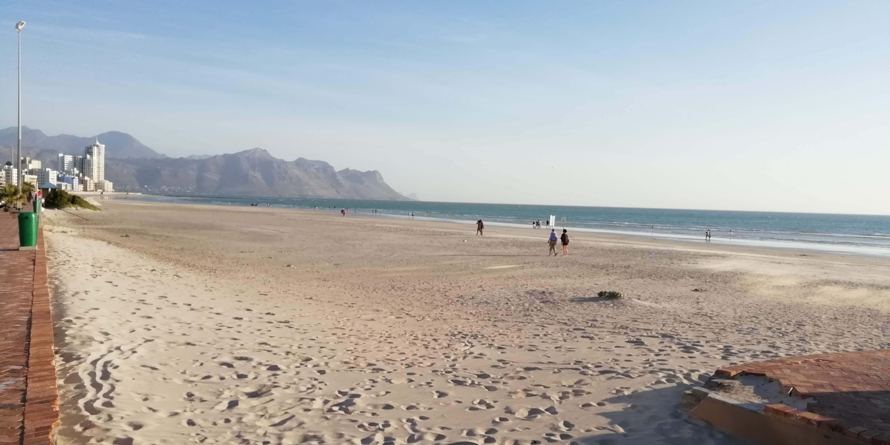
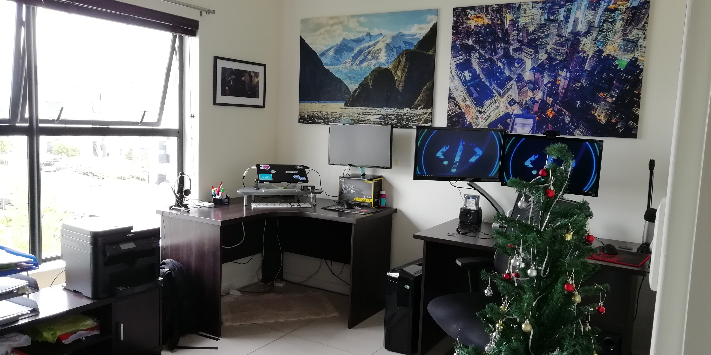
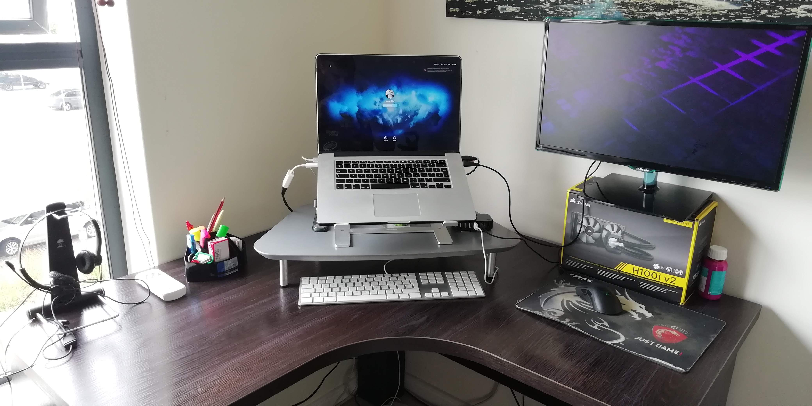
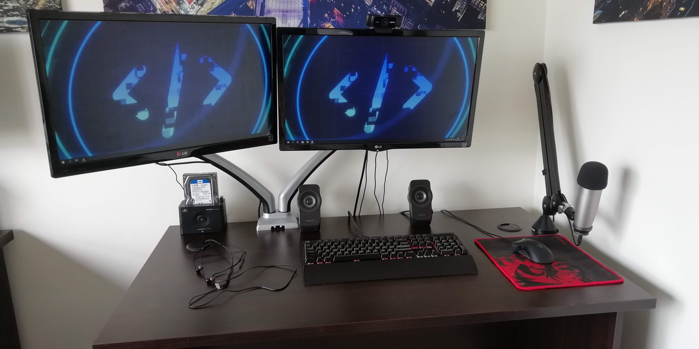
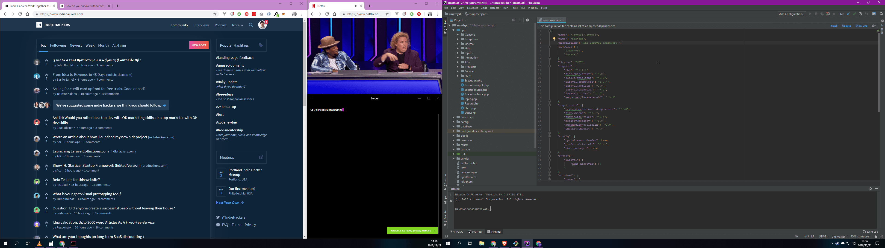

# Wogan May

Hi! I'm Wogan, a fulltime freelancer based in Strand, South Africa. I quit the corporate grind in April 2018 (a decade in digital marketing taught me much!) and decided to try my luck as a freelance developer and digital transformation consultant (also sometimes [I blog](https://wogan.blog)). So far it seems to be working out :)

I lived in Cape Town for quite a few years, but ended up choosing Strand for a few simple reasons: Lower rent, slower pace and better quality of life, a decent beach nearby, quicker access to great vacation spots, and most of my immediate family live in the area. I was fortunate enough to secure a 2-bedroom place in a security estate, and turned one of the bedrooms into my dedicated home office.

This is where I spend most of my time. I usually start work at around 8am, and endeavour to finish by 8pm. Being a freelancer though, I tend to push it as far as I can, as often as I can. On weekends I either spend some time gaming here, or in the living room - where I have an Xbox I bought at 50% discount during a WeChat sale, for essentially no reason other than it was cheap. That was an entertaining day.

The day I moved in I decided I absolutely had to decorate the walls - having stuff to look at other than blank white space really helps. The prints were done locally, using high-resolution photos from Unsplash.com. They ended up costing R620/print from [Wild Art Print](http://wildartprint.co.za) - money well spent. I eventually ended up setting up two desks: a corner desk for my mid-2013 Macbook Pro, and a straight desk for my Windows PC, on which I do most of the work while I'm at home. The Canon multifunction on the left there mostly comes in handy for scanning things.

I typically travel into Cape Town every 4-6 weeks for work, which is when the MBP gets the most use. It's a reliable workhorse - despite five years of upgrades it's stil able to holds its own. On a typical trip I mostly use it to take notes, fix urgent bugs and take calls. It never goes anywhere without a Rain LTE dongle!

This is where most of the magic happens. I made the switch to a Corsair mechanical keyboard in ____ and have loved it every single day since. That microphone off to the right is a Samson C01U PRO USB condenser (hanging off a Rode PSA1 arm), which I use for all my calls and some video voiceover work. I picked it up at a 43% discount on Takealot, and the quality is way better than I would get from a typical headset.

All of the above is backed by a solid 50mbps fiber connection, which has been a crucial ingredient in being able to run a freelance business remotely. You really want high-quality video calls and screenshare demos!

Machine specs:

* AMD FX™ 8350 8-core CPU @ 4.0GHz
* 16GB DDR3 RAM
* GTX 1050 Ti 4GB GFX carc
* Windows 10 Pro
* Corsair K70 RGB RAPIDFIRE keyboard
* Razer Deathadder 2013 mouse

## Software

Most of my work is done in Laravel (for which I'm certified), written in PHPStorm on Windows, using a Homestead VM as the local environment. Database work is done with Datagrip, and I do basic graphic stuff in Paint.NET when the need arises. I use Visual Studio Code quite a bit as a basic text editor, and have recently started to rely pretty heavily on Windows 10's Sticky Notes app for organizing my work.

On my Mac, I also have PHPStorm, DataGrip and MySQL Server installed, and just use the built-in PHP server. I don't typically do a lot of hardcore dev work on here though - in truth, a Macbook Air would probably do me just fine.

A typical project will include Laravel, [AdminLTE](https://adminlte.io/) (a fantastic Bootstrap-based admin template), VueJS, and deployment scripts written in Bash.

## Services and Subscriptions

There's a lot that goes into making everything work. I typically spend around R2500/month on hosting, domains, various subscriptions and services.

Services:
* [DigitalOcean](https://www.digitalocean.com) for hosting production and customer-facing applications
* [Vultr](https://www.vultr.com) for hosting personal projects on dirt-cheap servers.
* [Laravel Forge](https://forge.laravel.com) for server management and simple deploys
* [Laravel Envoyer](https://envoyer.io) to do zero-downtime deploys for one of my customers
* [Amazon AWS](https://aws.amazon.com) for Route53 (manages most of my domains)
* [iwantmyname.com](https://iwantmyname.com) for domains (They have 2FA and a zero-bullshit checkout experience)
* [RegisterDomain](https://www.registerdomain.co.za) for .co.za domains
* [BitBucket](https://www.bitbucket.org) for all my repos
* [Jetbrains](https://www.jetbrains.com) Subscription (for PHPStorm and DataGrip)
* [Toggl.com](https://toggl.com) for time tracking
* [Lucidchart](https://www.lucidchart.com) for diagrams (super useful for documentation, process and integration maps)
* [Office 365](https://www.office.com) for the 5-device license for the Office suite, installed on both my Mac and PC.

Then there's backoffice stuff. I do all my own bookkeeping, and pay a professional accounting firm (Exceed Financial Services) for payslips, tax calculations and annual returns. [Xero.com](https://www.xero.com/za) is my accounting platform of choice: It does bank feeds, reconciliation to accounts, all my invoicing, cashflow reporting, budgets and my end-of-year P&Ls. I shelled out for the multi-currency option, since I routinely transact in USD and GBP, and the automatic conversion and recon is a massive time- and headache-saver.

For international payments I rely on [Transferwise](https://transferwise.com/) - it allows foreign customers to pay "locally", and the remittance to South Africa is really quick. Recently I came across [Flutterwave](https://flutterwave.com/za/), which I plan on using for recurring billing on products I'm developing next year. I do have a PayPal Merchant account, but haven't used it for anything other than online purchases in the last 2 years.

Finally, the most crucial part: [G Suite](https://gsuite.google.com/). When I started out I was using Office365 for email and storage, but Google's offer is so much better. Today, I use the bundled Hangouts for as many calls as I can, and Google Sheets drives most of my backoffice business processes. I have custom addons that pull timesheets from Toggl, calculate my invoice line items, and manage my capacity outlook.